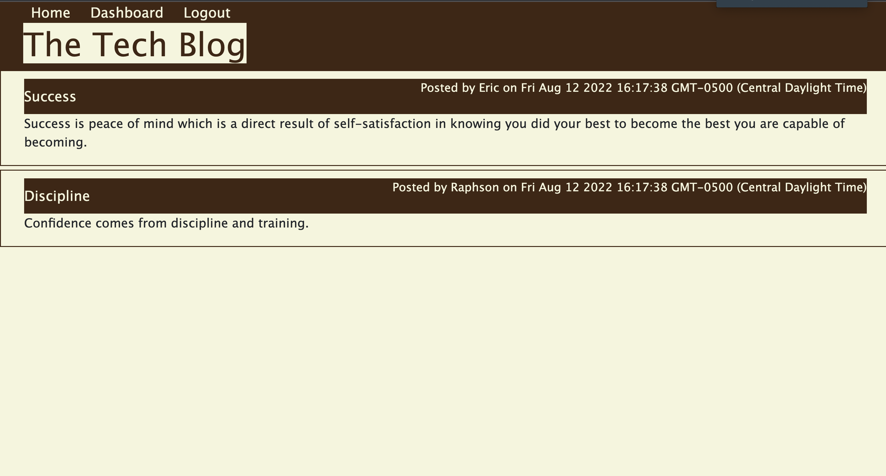

# TechBlog-Er

## Description

TechBlog-Er is a fullstack web application that users can log in to post blogs on their account and leave comments. 

TechBlog_Er was built following the MVC design. 

## Technologies

* Mysql
* Sequelize
* Express Js
* HandleBars
* HTML
* JavaScript
* Bcrypt
* CSS
* dotenv

## Installation

If you want this application on you local computer fell free to clone it or download it.
> NodeJs and Npm dependecies are required.

## Contributors

* Eric Ruboneka
* Email: Raphsoneric@gmail.com.

## Links

GitHub: https://github.com/raphson1/techBlog-Er
Deployed: https://techblog-er.herokuapp.com/

## Images

 